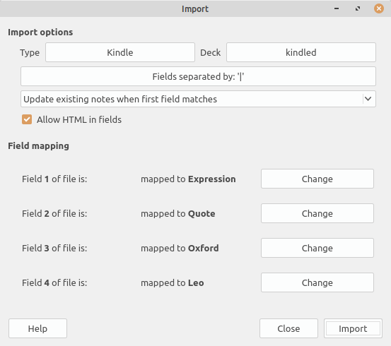
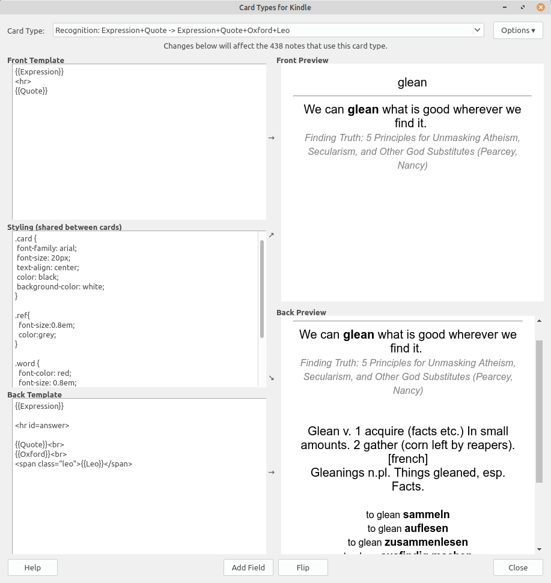
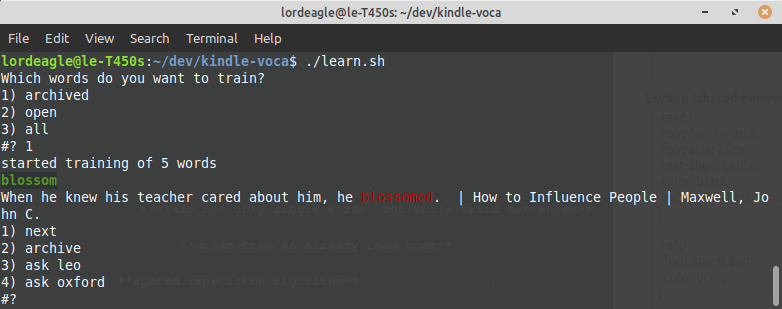

# Kindle Flashcards on steroids

> a mature bash based feed for Anki

Kindle has a great in book translation feature which makes content written in a foreign language highly accessible.

The kindle vocabulary trainer app on the device let's user train words that have been looked up. However, the app isn't perfect since it has poor response times (what comes natural on E-INC devies) and does not contain [spaced repetition](https://en.wikipedia.org/wiki/Spaced_repetition) features. Whats more, in the vocabulary trainer translation into native languages are not available, which would certainly help for difficult words where the oxford dictionary isn't precise enough.

## Own it
This toolchain brings your vocabulary lookups from kindle alive. Not only does it provide **oxford** dictionary translations and book **quotes**, but **leo** translations as well.

We export your voca with enriched data into an Anki flash card compatible format. So, you can expand your vocabulary and train at ease on your mobile device whenever you feel like.

## Learn with passion

- learn **words you really care about**, since they were in your way while reading a great book rather than learning a bunch of pre-selected vocabulary from your prof.
- read real occurences of the word while training, so you can **claim not only single words, but whole valid sentences** too.
- keep in touch with your books, you may get motived to re-read or **dream from an already read book** by reading its quotes.
- let science help you to **learn effective**: profit from **spaced repetition algorithm** and accessible apps just built for the job to meak voca training fun.

# Get started
Tested on a debian based system such as Ubuntu / Linux Mint.

1. Clone this repository `git clone https://github.com/ivy-rew/kindle-voca.git`
2. Copy your vocadb.db from your kindle `system/vocabulary/vocab.db` into the 'sample' dir of your working copy.
3. run `anki.sh` to produce a textfile (anki.txt) which contains your lookups enriched with translations
4. install the anki desktop app `sudo apt install anki`
5. login with an existing ankiweb account or create one [online](https://ankiweb.net)
5. Import the 'kindled' deck from [sample/kindled_empty.apk](sample/kindled_empty.apkg?raw=true)
6. use the importer to load the data into the anki deck
 
7. run the synchronization to put it on the web (usually private for your account)
8. download the anki app for your mobile device (e.g. [ankidroid](https://play.google.com/store/apps/details?id=com.ichi2.anki))
9. login and start training your deck

# Customize
Use the Anki templating mechanism to arrange flash cards just how you love em:

 

## Bash lunatics
We love bash! And sometimes we don't care about spaced repetition and stuff... So a basic vocabulary trainer is also available in plain bash. Just run `./learn.sh` in order to practice in a shell 🤩

 
